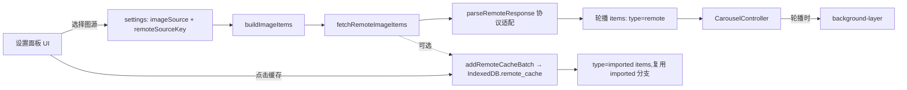

## 产品概述

在新标签页扩展的设置面板中提供"网络图源"模块，让用户从 5 个内置的二次元图片 API 中一键切换，并允许用户自定义接入自己的图源接口；提供一份"漫画风格说明书"说明如何配置自定义图源；支持在线实时拉取与一键手动缓存到本地（IndexedDB）双模式。

## 核心功能

- 在「背景图片」section 增 5 个内置图源单选项（必含 Picsum 兜底测试用 + 4 个二次元向），加 1 个「自定义图源」入口
- 自定义图源支持三种返回协议：JSON 数组、JSON 对象、302 直链
- 协议适配层：按"取图字段路径"（支持点号路径如 `acgurl`、`results.0.url`）从 JSON 中抽 URL
- 一次拉取 30 张左右入轮播池，配合现有 `CarouselController`
- 漫画风格说明书：可点开折叠，按四格/对话气泡形式讲解三种协议如何配置
- 缓存：用户可点击「缓存当前图源」把刚拉到的 URL 列表逐张 fetch 成 blob 写入 IndexedDB，写入后即可离线使用
- 错误处理：fetch 失败、CORS 拒绝、字段路径取不到值时给出明确文案

## 技术栈

- 纯前端：HTML + 原生 CSS（沿用现有 token）+ 原生 JavaScript（无构建）
- 存储：IndexedDB（在 `myedgenewtab` 库新增 `remote_cache` store，与现有 `images` store 区分）
- 网络：原生 `fetch()`（chrome-extension:// 上下文默认不受 CORS 限制，遇到服务器 CORS 拒绝会失败并提示）
- 沿用项目已有：`ObjectUrlCache` / `CarouselController` / `withStore` / `normalizeSettings` / `applyCssVars` / `packaged-tip` 卡片样式

## 实现方案

### 1. 新图源协议适配层（核心抽象）

```js
const REMOTE_SOURCES = {
  picsum: {
    name: 'Lorem Picsum（风景示例）',
    type: 'json-array',
    url: 'https://picsum.photos/v2/list?limit=30',
    path: 'download_url',
  },
  konachan: {
    name: 'Konachan（动漫·安全向）',
    type: 'json-array',
    url: 'https://konachan.net/post.json?limit=30&tags=order:random',
    path: 'file_url',
  },
  nekosapi: {
    name: 'NekosAPI（动漫·分类丰富）',
    type: 'json-object',
    url: 'https://nekosapi.com/v3/images/random?limit=30',
    path: 'results.0.url', // 但实际是数组——见下方
  },
  yppp: {
    name: '南风 API（自适应·二次元）',
    type: 'json-object',
    url: 'https://api.yppp.net/pc.php?return=json',
    path: 'acgurl',
  },
  uapis: {
    name: 'UApiPro ACG（直链 302）',
    type: 'redirect',
    url: 'https://uapis.cn/api/v1/random/image?category=acg&type=pc',
  },
};
```

抽出 `parseRemoteResponse(source, response)` 统一三协议：

- `json-array`：`await resp.json()` → 在数组上按 `path` 取字段；批量产出 30 个 URL
- `json-object`：先按 `path` 走点号路径取值；若是字段值数组则当 json-array 处理；否则当单图
- `redirect`：`response.url`（fetch 自动跟随 302）取最终直链，单图模式

为避免每张图各 fetch 一次（json-array 已含 30 张，redirect 只 1 张），redirect 模式单独走"按需批量抓"逻辑：用 `Promise.all` + 串行替换，按 N 次拉取填满 30 个槽位，并做去重。

### 2. IndexedDB schema 升级

把 `openDb` 升级到 v2，在 `onupgradeneeded` 里增量创建 `remote_cache`：

```js
request.onupgradeneeded = (e) => {
  const db = request.result;
  if (!db.objectStoreNames.contains('images')) {
    const store = db.createObjectStore('images', { keyPath: 'id' });
    store.createIndex('addedAt', 'addedAt', { unique: false });
  }
  if (!db.objectStoreNames.contains('remote_cache')) {
    const cache = db.createObjectStore('remote_cache', { keyPath: 'id' });
    cache.createIndex('sourceKey', 'sourceKey', { unique: false });
    cache.createIndex('addedAt', 'addedAt', { unique: false });
  }
};
```

加 `addRemoteCacheBatch(records)` / `listRemoteCacheBySource(sourceKey)` / `deleteRemoteCacheBySource(sourceKey)`，逻辑复用 `withStore`。

### 3. DEFAULT_SETTINGS 增量

```js
imageSource: 'imported',
remoteSourceKey: 'picsum',         // 当前选的内置图源 key 或 'custom'
customEndpoint: '',                // 自定义 URL
customResponseType: 'json-array',  // json-array | json-object | redirect
customImageField: 'url',           // 自定义取图字段路径
customBatchSize: 30,               // 一次拉多少
cacheToLocal: false,               // 是否在拉取后自动落 IndexedDB
```

`normalizeSettings` 中：枚举校验、URL 走 `URL` 构造校验、白名单字段名（`/^[\w.\[\]0-9-]+$/`）防止注入。

### 4. 轮播层接入

扩展 `CarouselController.getCssBackground` / `getPreloadUrl`：新增 `type: 'remote'` 分支（直接返回 URL，无需 IndexedDB）。

`buildImageItems(settings)` 新分支：选 `imageSource === 'remote'` 时调用 `fetchRemoteImageItems(settings)` 拉 30 个 → `[{ type: 'remote', url, name }]`；失败时回退到 packaged 列表（与现有 fallback 策略保持一致）。

### 5. 漫画风格说明书

**视觉方案**：沿用现有 `.tip-box` 卡片体系（黄底 + 3px 左色条）做底，加上 4 个分块代表"4 格漫画"：每块用大号表情符号当"角色"，右侧对话气泡用稍深的同色调块。文末加"复制示例"按钮（`navigator.clipboard.writeText`）。

内容大纲：

1. 第一格：选择协议类型（json-array / json-object / redirect）
2. 第二格：在浏览器里测试接口（f12 Network → 看 Response 标签）
3. 第三格：填写"取图字段"——演示 `acgurl`、`download_url`、`data[0].url` 三种典型路径
4. 第四格：点"测试"按钮验证（前端 fetch 一次，成功显示首图，失败显示错误码）

### 6. CORS / 错误处理

- chrome-extension:// 页面的 `fetch` 在 MV3 下默认**不受 CORS 限制**（属于 privileged context），可以直接请求任何 HTTPS。
- 但部分 CDN（`i.pximg.net` 等）有 referer 防盗链，导致**图片本身**加载失败（`` 或 `background-image` 看到裂图）。在 fetch 拿到 URL 后**先做一次 `` 预加载测试**（`preload` 函数已存在），失败的剔除；同时在 UI 上提示"该图源对浏览器/扩展的 Referer 做了限制，可能部分图片无法显示"。
- 错误分类提示文案：
- 网络错误：`未连接到图源，请检查网络`
- HTTP 非 2xx：`图源返回 {status}`
- 解析失败：`JSON 解析失败，请检查接口地址`
- 字段路径取不到值：`未在响应中找到字段「{field}」，请检查取图字段`

## 架构设计



## 实施说明

- **复用优先**：`` 预加载逻辑 `preload(url)`、`ObjectUrlCache`、`withStore` 都直接复用，不复制实现
- **零新增依赖**：沿用 chrome.storage.local / localStorage / IndexedDB；不引入任何 npm 包
- **blast radius 控制**：
- 现有 `imageSource` 取值新增 `'remote'`，在 `normalizeSettings` 里只增不替
- `buildImageItems` 走 `if/else` 分支，不动 `imported` / `packaged` 路径
- 现有用户的存储数据无破坏（`images` store 完全不变；`remote_cache` 是新增）
- **日志**：fetch 失败 / 字段解析失败一律 `console.warn('[remote-image]', ...)`，避免把图片 URL 打到日志造成 PII 风险
- **manifest**：暂不动 `host_permissions`，因为 chrome-extension 上下文 fetch 默认无 CORS；若未来用户反馈具体 CDN 真的被拦，再补 `host_permissions`

## 目录结构

仅修改三个现有文件（项目约束：无构建、纯前端）：

```
d:/MrKLLM/MyEdgeNewTab/
├── index.html                 # [MODIFY] 在「背景图片」section 增 5 个图源单选 + 自定义入口
│                              #        + 「漫画说明书」折叠面板 + 「缓存」按钮
├── script.js                  # [MODIFY] +REMOTE_SOURCES, parseRemoteResponse, fetchRemoteImageItems
│                              #        +IDB v2 schema, addRemoteCacheBatch
│                              #        +DEFAULT_SETTINGS 增量, normalizeSettings 校验
│                              #        +buildImageItems remote 分支
│                              #        +CarouselController remote 类型支持
│                              #        +设置 UI 事件: 图源切换/自定义填写/测试/缓存
└── styles.css                 # [MODIFY] +.source-list 网格, .manga-manual 四格布局
                               #        +.manga-cell 角色格, .manga-bubble 气泡, .test-result 反馈
                               #        +.cache-btn, .cache-progress 进度条
                               #        所有新增样式沿用 :root token（间距、圆角、颜色、时长、曲线）
```

## 关键代码结构

```js
// —— 三协议统一解析 ——
async function parseRemoteResponse(source, response) {
  if (source.type === 'redirect') {
    // fetch 已自动跟随 302，response.url 即最终直链
    return [{ url: response.url, name: extractNameFromUrl(response.url) }];
  }
  const data = await response.json();
  if (source.type === 'json-array') {
    if (!Array.isArray(data)) throw new Error('返回不是 JSON 数组');
    return data.map((item, i) => ({ url: getByPath(item, source.path), name: `remote-${i}` }))
               .filter(x => typeof x.url === 'string' && x.url.startsWith('http'));
  }
  if (source.type === 'json-object') {
    const url = getByPath(data, source.path);
    if (Array.isArray(url)) {
      return url.filter(u => typeof u === 'string' && u.startsWith('http'))
                .map((u, i) => ({ url: u, name: `remote-${i}` }));
    }
    if (typeof url === 'string' && url.startsWith('http')) {
      return [{ url, name: extractNameFromUrl(url) }];
    }
    throw new Error(`未在响应中找到字段「${source.path}」`);
  }
}

// —— 递归取点号路径 ——
function getByPath(obj, path) {
  return path.split('.').reduce((o, k) => (o == null ? undefined : o[k]), obj);
}
```

```js
// —— IndexedDB v2 升级 + remote_cache store ——
const DB_VERSION = 2;
const request = indexedDB.open('myedgenewtab', DB_VERSION);
request.onupgradeneeded = () => {
  const db = request.result;
  if (!db.objectStoreNames.contains('images')) { /* 保留原有逻辑 */ }
  if (!db.objectStoreNames.contains('remote_cache')) {
    const store = db.createObjectStore('remote_cache', { keyPath: 'id' });
    store.createIndex('sourceKey', 'sourceKey', { unique: false });
  }
};

async function addRemoteCacheBatch(records) {
  // 与 addImportedImages 几乎同构,recycle withStore
}
async function listRemoteCacheBySource(sourceKey) {
  return withStore('readonly', store => new Promise((res, rej) => {
    const req = store.index('sourceKey').getAll(sourceKey);
    req.onsuccess = () => res(req.result || []);
    req.onerror = () => rej(req.error);
  }));
}
```

## Agent Extensions

本任务为纯前端代码实现，**不涉及多媒体生成、浏览器自动化或第三方文档/表格处理**。当前上下文未提供与本任务强相关的 Skill 或 SubAgent，**故省略 `<extensions>` 标签**。